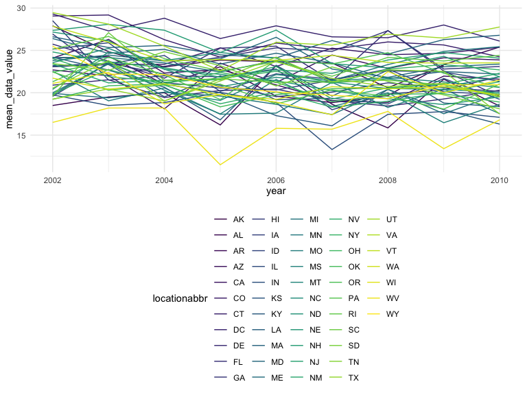
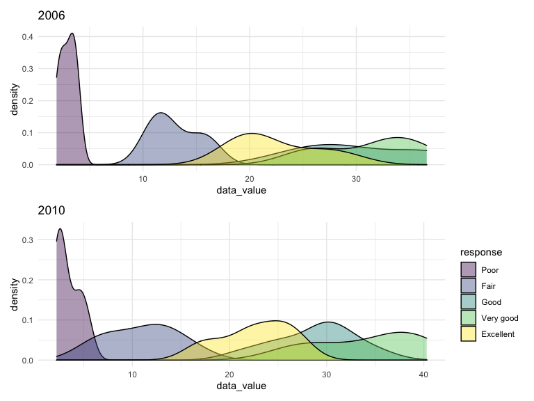

hw3
================
Yu Si
10/20/2021

## Problem 1

``` r
data("instacart")
instacart = as_tibble(instacart)
```

In this dataset, there are 1384617 rows and 15 columns. Variable
represents users, order, product and related information. Each row
represent each product from order. order-related variable included
number, day and hour, such as order\_number and
days\_since\_prior\_order. product-related variable included product
name, aisle and department, such as fresh fruit, Banana, dairy eggs.

### 1.a

``` r
instacart %>% 
  count(aisle, sort = TRUE)
```

    ## # A tibble: 134 × 2
    ##    aisle                              n
    ##    <chr>                          <int>
    ##  1 fresh vegetables              150609
    ##  2 fresh fruits                  150473
    ##  3 packaged vegetables fruits     78493
    ##  4 yogurt                         55240
    ##  5 packaged cheese                41699
    ##  6 water seltzer sparkling water  36617
    ##  7 milk                           32644
    ##  8 chips pretzels                 31269
    ##  9 soy lactosefree                26240
    ## 10 bread                          23635
    ## # … with 124 more rows

There are 134 aisles and the most item is fresh vegetable.

### 1.b

``` r
instacart %>% 
  count(aisle) %>% 
  filter(n > 10000) %>% 
  mutate(aisle = reorder(aisle, n)) %>% 
  ggplot(aes(x = aisle, y = n)) + 
  geom_point() + 
  labs(title = "the number of items ordered in each aisle") +
  theme(axis.text.x = element_text(angle = 70, hjust = 1))
```


### 1.c

``` r
instacart %>% 
  filter(aisle %in% c("baking ingredients", "dog food care", "packaged vegetables fruits")) %>%
  group_by(aisle) %>% 
  count(product_name) %>% 
  mutate(rank = min_rank(desc(n))) %>% 
  filter(rank < 4) %>% 
  arrange(desc(n)) %>%
  knitr::kable()
```

| aisle                      | product\_name                                 |    n | rank |
|:---------------------------|:----------------------------------------------|-----:|-----:|
| packaged vegetables fruits | Organic Baby Spinach                          | 9784 |    1 |
| packaged vegetables fruits | Organic Raspberries                           | 5546 |    2 |
| packaged vegetables fruits | Organic Blueberries                           | 4966 |    3 |
| baking ingredients         | Light Brown Sugar                             |  499 |    1 |
| baking ingredients         | Pure Baking Soda                              |  387 |    2 |
| baking ingredients         | Cane Sugar                                    |  336 |    3 |
| dog food care              | Snack Sticks Chicken & Rice Recipe Dog Treats |   30 |    1 |
| dog food care              | Organix Chicken & Brown Rice Recipe           |   28 |    2 |
| dog food care              | Small Dog Biscuits                            |   26 |    3 |

### 1.d

``` r
instacart %>% 
  filter(product_name == c("Pink Lady Apples", "Coffee Ice Cream")) %>% 
  select(product_name, order_dow, order_hour_of_day) %>% 
  group_by(product_name, order_dow) %>% 
  summarize(mean_hour = mean(order_hour_of_day)) %>% 
  pivot_wider(
    names_from = order_dow,
    values_from = mean_hour
  ) %>%
  knitr::kable()
```

    ## Warning in product_name == c("Pink Lady Apples", "Coffee Ice Cream"): longer
    ## object length is not a multiple of shorter object length

    ## `summarise()` has grouped output by 'product_name'. You can override using the `.groups` argument.

| product\_name    |        0 |        1 |        2 |       3 |        4 |        5 |        6 |
|:-----------------|---------:|---------:|---------:|--------:|---------:|---------:|---------:|
| Coffee Ice Cream | 13.22222 | 15.00000 | 15.33333 | 15.4000 | 15.16667 | 10.33333 | 12.35294 |
| Pink Lady Apples | 12.25000 | 11.67857 | 12.00000 | 13.9375 | 11.90909 | 13.86957 | 11.55556 |

## Problem 2

``` r
data("brfss_smart2010")
brfss = brfss_smart2010 %>% 
  janitor::clean_names() %>% 
  filter(topic == "Overall Health", response %in% c("Excellent", "Very good", "Good", "Fair", "Poor")) %>% 
  mutate(
    response = factor(response),
    response = fct_relevel(response, "Poor", "Fair", "Good", "Very good", "Excellent"))
```

### 2.a

``` r
brfss %>% 
  filter(year %in% c("2002", "2010")) %>% 
  group_by(year) %>% 
  count(locationabbr) %>%  
  filter(n>=7) %>% 
  knitr::kable()
```

| year | locationabbr |   n |
|-----:|:-------------|----:|
| 2002 | AZ           |  10 |
| 2002 | CO           |  20 |
| 2002 | CT           |  35 |
| 2002 | DE           |  15 |
| 2002 | FL           |  35 |
| 2002 | GA           |  15 |
| 2002 | HI           |  20 |
| 2002 | ID           |  10 |
| 2002 | IL           |  15 |
| 2002 | IN           |  10 |
| 2002 | KS           |  15 |
| 2002 | LA           |  15 |
| 2002 | MA           |  40 |
| 2002 | MD           |  30 |
| 2002 | ME           |  10 |
| 2002 | MI           |  20 |
| 2002 | MN           |  20 |
| 2002 | MO           |  10 |
| 2002 | NC           |  35 |
| 2002 | NE           |  15 |
| 2002 | NH           |  25 |
| 2002 | NJ           |  40 |
| 2002 | NV           |  10 |
| 2002 | NY           |  25 |
| 2002 | OH           |  20 |
| 2002 | OK           |  15 |
| 2002 | OR           |  15 |
| 2002 | PA           |  50 |
| 2002 | RI           |  20 |
| 2002 | SC           |  15 |
| 2002 | SD           |  10 |
| 2002 | TN           |  10 |
| 2002 | TX           |  10 |
| 2002 | UT           |  25 |
| 2002 | VT           |  15 |
| 2002 | WA           |  20 |
| 2010 | AL           |  15 |
| 2010 | AR           |  15 |
| 2010 | AZ           |  15 |
| 2010 | CA           |  60 |
| 2010 | CO           |  35 |
| 2010 | CT           |  25 |
| 2010 | DE           |  15 |
| 2010 | FL           | 205 |
| 2010 | GA           |  20 |
| 2010 | HI           |  20 |
| 2010 | IA           |  10 |
| 2010 | ID           |  30 |
| 2010 | IL           |  10 |
| 2010 | IN           |  15 |
| 2010 | KS           |  20 |
| 2010 | LA           |  25 |
| 2010 | MA           |  45 |
| 2010 | MD           |  60 |
| 2010 | ME           |  30 |
| 2010 | MI           |  20 |
| 2010 | MN           |  25 |
| 2010 | MO           |  15 |
| 2010 | MS           |  10 |
| 2010 | MT           |  15 |
| 2010 | NC           |  60 |
| 2010 | ND           |  15 |
| 2010 | NE           |  50 |
| 2010 | NH           |  25 |
| 2010 | NJ           |  95 |
| 2010 | NM           |  30 |
| 2010 | NV           |  10 |
| 2010 | NY           |  45 |
| 2010 | OH           |  40 |
| 2010 | OK           |  15 |
| 2010 | OR           |  20 |
| 2010 | PA           |  35 |
| 2010 | RI           |  25 |
| 2010 | SC           |  35 |
| 2010 | SD           |  10 |
| 2010 | TN           |  25 |
| 2010 | TX           |  80 |
| 2010 | UT           |  30 |
| 2010 | VT           |  30 |
| 2010 | WA           |  50 |
| 2010 | WY           |  10 |

### 2.b

``` r
brfss %>% 
  group_by(year, locationabbr) %>% 
  filter(response == "Excellent") %>% 
  select(year, locationabbr, data_value) %>% 
  summarize(mean_data_value = mean(data_value, na.rm = TRUE)) %>% 
  ggplot(aes(x= year, y = mean_data_value, color = locationabbr))+
  geom_line(aes(group = locationabbr))
```

    ## `summarise()` has grouped output by 'year'. You can override using the `.groups` argument.



### 2.c

``` r
plot_2006 = 
  brfss %>% 
  group_by(response) %>% 
  filter(year == 2006, locationabbr=="NY") %>% 
  select(locationabbr, response, data_value) %>% 
  ggplot(aes(x = data_value, fill = response)) +
  geom_density(alpha = .4) + theme(legend.position = "none") +
  labs(title = "2006")


plot_2010 = 
  brfss %>% 
  group_by(response) %>% 
  filter(year == 2010, locationabbr=="NY") %>% 
  select(locationabbr, response, data_value) %>% 
  ggplot(aes(x = data_value, fill = response)) +
  geom_density(alpha = .4) + theme(legend.position = "right") + labs(title = "2010")

plot_2006/plot_2010
```


